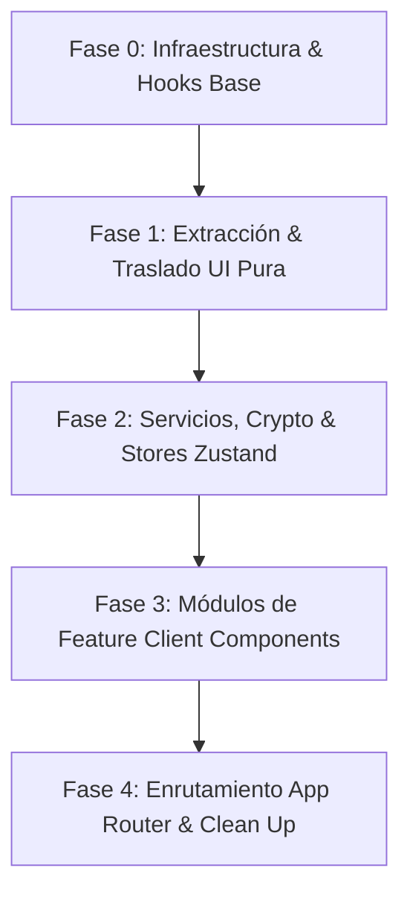

# Reporte de Arquitectura e Ingeniería Inversa: Migración a Next.js 16 (App Router)

> [!NOTE]
> Este documento ha sido generado por el **Arquitecto de Software y Analista de Código** a través de la inspección estática del código fuente original de la aplicación **PassFrases** (Vite + React 19 + React Router v7 + Zustand + Tailwind v4). No se ha modificado ningún archivo del proyecto.

---

## 1. Mapeo de la Arquitectura Actual

El proyecto sigue un patrón modular híbrido (**Domain-Driven / Feature-Based Layout**) combinado con un núcleo compartido (`shared/`) y servicios transversales (`services/`).

```text
passfrases-proyect/
├── package.json                   # Configuración de dependencias y scripts de Vite
├── vite.config.ts                 # Configuración de Vite con alias '@' -> 'src/'
├── index.html                     # Punto de entrada HTML de la SPA
└── src/
    ├── main.tsx                   # Bootstrapping de React 19 (createRoot)
    ├── index.css                  # Estilos globales, variables CSS custom y directiva Tailwind v4
    ├── app/                       # Configuración de infraestructura SPA (A eliminar en Next.js)
    │   ├── providers.tsx          # Envoltorio global con BrowserRouter y HistoryPanel
    │   └── router.tsx             # Enrutador cliente (React Router v7) con lazy-loading
    ├── services/                  # Servicios de lógica agnóstica a componentes de UI
    │   └── crypto.service.ts      # Cifrado/Descifrado simétrico AES-GCM (Web Crypto API)
    ├── shared/                    # Módulo universal reutilizable por cualquier feature
    │   ├── components/
    │   │   └── ui/                # Layouts y componentes de UI visuales
    │   │       ├── AppLayout.tsx     # Shell principal (Header con badge '100% local' y Footer)
    │   │       ├── ConfirmDialog.tsx # Modal de confirmación accesible (<dialog> HTML)
    │   │       ├── StepProgress.tsx  # Barra/Stepper visual de 3 pasos
    │   │       └── WizardLayout.tsx  # Contenedor tipo tarjeta con efecto radial 'Glow'
    │   ├── lib/
    │   │   └── cn.ts                 # Utilidad para unión condicional de clases (clsx + tailwind-merge)
    │   └── types/
    │       └── crypto.types.ts       # Definiciones de TypeScript para payloads cifrados
    └── features/                  # Módulos por dominio funcional de negocio
        ├── generator/             # NÚCLEO: Algoritmos de generación, entropía y wizard
        │   ├── analysis.ts        # Reglas de análisis de fortaleza y recomendaciones de seguridad
        │   ├── entropy.ts         # Cálculo de entropía matemática en bits (log2)
        │   ├── generate.ts        # Selección aleatoria segura de palabras (crypto.getRandomValues)
        │   ├── store.ts           # Zustand Store (configuración, estado del wizard e historial de sesión)
        │   ├── types.ts           # Definiciones de tipos del dominio del generador
        │   ├── wordLists.json     # Diccionario de palabras categorizadas en español (~2.2 KB)
        │   ├── components/
        │   │   ├── CategoryChips.tsx    # Selector multiselección de categorías de palabras
        │   │   ├── CopyButton.tsx       # Botón con animación y copia al portapapeles
        │   │   ├── EntropyMeter.tsx     # Indicador visual y gráfico de bits de entropía
        │   │   ├── FunStats.tsx         # Badges informativas de composición del passphrase
        │   │   ├── GeneratorForm.tsx    # Formulario completo (slider, selects, toggles avanzados)
        │   │   ├── GeneratorPanel.tsx   # Coordinador de vistas según paso activo del wizard
        │   │   └── PasswordActions.tsx  # Visualización de frase, copia cifrada y guardado
        │   └── pages/
        │       ├── GeneratorPage.tsx   # Vista del wizard en pasos 2 y 3 ('/generator')
        │       └── WizardStartPage.tsx # Landing inicial / Paso 1 ('/')
        ├── favorites/             # MÓDULO: Almacenamiento local seguro de contraseñas favoritas
        │   ├── components/
        │   │   └── FavoritesPanel.tsx   # Drawer lateral de contraseñas guardadas
        │   ├── hooks/
        │   │   └── useFavorites.ts      # Hook conector con la store de favoritos
        │   ├── store.ts                 # Zustand Store con persistencia cifrada en localStorage
        │   └── types.ts                 # Tipos del dominio de favoritos
        ├── clippy/                # MÓDULO: Asistente interactivo flotante y tips contextuales
        │   └── components/
        │       └── ClippyAssistant.tsx  # Widget flotante con sugerencias dinámicas y badge
        └── batch/                 # MÓDULO: Generador masivo en lote e historial extendido
            ├── components/
            │   ├── BatchGenerator.tsx   # Formulario y tabla de generación masiva
            │   └── HistoryPanel.tsx     # Drawer lateral de historial acumulado de sesión
            └── pages/
                └── BatchPage.tsx        # Vista contenedora de la ruta '/batch'
```

### Responsabilidad de cada Módulo Principal:

1. **`src/app/`**: Gestiona la infraestructura de inicio de la SPA. **Totalmente obsoleto en Next.js** ya que Next.js asume el enrutamiento (`app/`) y los providers globales (`app/layout.tsx`).
2. **`src/services/`**: Encapsula operaciones criptográficas asíncronas con Web Crypto API (`PBKDF2` y `AES-GCM`). Cero dependencia de UI o React. Requiere ejecutarse en el navegador (`window.crypto.subtle`).
3. **`src/shared/`**: Aloja tipos globales, la utilidad `cn()` y los componentes estructurales de UI (`AppLayout`, `WizardLayout`, `ConfirmDialog`, `StepProgress`).
4. **`src/features/generator/`**: Corazón de la aplicación. Divide claramente la matemática pura (`entropy.ts`, `generate.ts`, `analysis.ts`), el estado global (`store.ts`) y los componentes de visualización y control.
5. **`src/features/favorites/`**: Maneja el CRUD de favoritos almacenados localmente en `localStorage` previa encriptación.
6. **`src/features/clippy/`**: Provee el asistente virtual que reacciona a los cambios en las opciones del formulario y la entropía calculada.
7. **`src/features/batch/`**: Permite la generación masiva de hasta 50 passphrases en lote y gestiona el historial de la sesión activa.

---

## 2. Identificación y Diagnóstico de Componentes de UI (Objetivo Fase 1)

A continuación se detalla la auditoría completa de los componentes visuales del proyecto, identificando si son componentes "puros/tontos" (que solo dependen de props) o si están acoplados a estado global (Zustand) o librerías de enrutamiento:

| Componente | Ruta Exacta Original | Estado de Acoplamiento | Diagnóstico / Plan de Extracción |
| :--- | :--- | :--- | :--- |
| **`AppLayout`** | `src/shared/components/ui/AppLayout.tsx` | 🟢 **100% Puro** | Shell visual principal. No consume stores ni router. Apto para integrarse con `app/layout.tsx`. |
| **`ConfirmDialog`** | `src/shared/components/ui/ConfirmDialog.tsx` | 🟢 **100% Puro** | Modal nativo (`<dialog>`). Solo usa `useEffect` y `useRef`. Requiere marcarse con `'use client'`. |
| **`CopyButton`** | `src/features/generator/components/CopyButton.tsx` | 🟢 **100% Puro** | Componente atómico de UI. No depende del store de generador. **Acción de Fase 1**: Mover a `src/shared/components/ui/CopyButton.tsx` y añadir `'use client'`. |
| **`EntropyMeter`** | `src/features/generator/components/EntropyMeter.tsx` | 🟢 **100% Puro** | Recibe `bits` y `maxBits` por props. Depende solo de funciones puras (`entropy.ts`). Apto para mover en Fase 1 a UI compartida o mantener en feature. |
| **`FunStats`** | `src/features/generator/components/FunStats.tsx` | 🟢 **100% Puro** | Recibe todas sus métricas por props (`wordCount`, `bits`, `hasNumbers`, etc.). Componente de presentación puro. |
| **`ToggleOption`** *(Interno)* | Embedded en `src/features/generator/components/GeneratorForm.tsx` (L282-352) | 🟢 **100% Puro** | Switch accesibles (`role="switch"`). **Acción de Fase 1**: Extraer como componente atómico independiente a `src/shared/components/ui/Toggle.tsx` con `'use client'`. |
| **`WizardLayout`** | `src/shared/components/ui/WizardLayout.tsx` | 🟡 **Acoplamiento Indirecto** | Renderiza `StepProgress` dentro. Si `StepProgress` se desvincula de Zustand, `WizardLayout` se vuelve 100% puro. |
| **`StepProgress`** | `src/shared/components/ui/StepProgress.tsx` | 🔴 **Acoplado a Zustand** | Consume `usePasswordStore` internamente (`currentStep`). **Acción de Fase 1**: Refactorizar para recibir `currentStep: number` por props, convirtiéndolo en un componente de UI puro. |
| **`CategoryChips`** | `src/features/generator/components/CategoryChips.tsx` | 🔴 **Acoplado a Zustand** | Consume `state.config.selectedCategories` y `state.setConfig` directamente de `usePasswordStore`. |
| **`PasswordActions`** | `src/features/generator/components/PasswordActions.tsx` | 🔴 **Acoplado a Favoritos & Crypto** | Invoca `useFavorites()` y `encryptPassword()`. Requiere migración en Fase 3 como Client Component. |
| **`GeneratorForm`** | `src/features/generator/components/GeneratorForm.tsx` | 🔴 **Acoplado a Zustand** | Lee y escribe en `usePasswordStore`. Requiere migración en Fase 3. |
| **`GeneratorPanel`** | `src/features/generator/components/GeneratorPanel.tsx` | 🔴 **Acoplado a React Router v7 & Store** | Usa `useNavigate()` de `react-router-dom` y `usePasswordStore`. |
| **`ClippyAssistant`** | `src/features/clippy/components/ClippyAssistant.tsx` | 🔴 **Acoplado a Store & Browser Crypto** | Lee el paso activo, historial y resultados de Zustand. |
| **`FavoritesPanel`** | `src/features/favorites/components/FavoritesPanel.tsx` | 🔴 **Acoplado a Favoritos** | Consume `useFavorites` store. |
| **`BatchGenerator`** | `src/features/batch/components/BatchGenerator.tsx` | 🔴 **Acoplado a Store & Lógica** | Invoca lógica de generación y guarda en el store de sesión. |
| **`HistoryPanel`** | `src/features/batch/components/HistoryPanel.tsx` | 🔴 **Acoplado a Store** | Consume `sessionHistory` de `usePasswordStore`. |

---

## 3. Hoja de Ruta por Fases para Next.js 16 (App Router)

Premisas del proyecto destino:
* Next.js 16 (App Router) preconfigurado.
* `app/layout.tsx` base y Tailwind CSS v4 en `app/globals.css`.



---

### 📦 FASE 0: Preparación de la Infraestructura y Configuración

**Objetivo:** Establecer los cimientos del proyecto sin tocar la UI ni la lógica de negocio.

1. **Instalación de Dependencias Compatibles:**
   - Asegurar en `package.json`: `zustand`, `lucide-react`, `clsx`, `tailwind-merge`, `@tailwindcss/postcss`.
2. **Configuración del Helper de Estilos:**
   - Copiar `src/shared/lib/cn.ts` al proyecto Next.js.
3. **Creación del Hook de Hidratación (Mitigación de Hydration Mismatch en SSR):**
   - Crear `src/shared/hooks/useHasMounted.ts`:
     ```typescript
     'use client'
     import { useEffect, useState } from 'react'
     export function useHasMounted() {
       const [hasMounted, setHasMounted] = useState(false)
       useEffect(() => { setHasMounted(true) }, [])
       return hasMounted
     }
     ```

---

### 🎨 FASE 1: Extracción y Traslado del Sistema de UI (Componentes Puros)

**Objetivo:** Mover todos los componentes puramente visuales y desacoplar los que tengan referencias directas a Zustand o React Router.

#### Archivos y Cambios Exactos a Trasladar:

1. **`src/shared/components/ui/ConfirmDialog.tsx`**:
   - **Cambio:** Agregar `'use client'` en la línea 1 (usa `useEffect` y `useRef`).
2. **`src/shared/components/ui/CopyButton.tsx`** *(Reubicado)*:
   - **Cambio:** Mover de `src/features/generator/components/CopyButton.tsx` a `src/shared/components/ui/CopyButton.tsx`. Agregar `'use client'` (usa `useState`, `useCallback` y `navigator.clipboard`).
3. **`src/shared/components/ui/Toggle.tsx`** *(Nuevo Componente Extraído)*:
   - **Cambio:** Extraer el componente interno `ToggleOption` ubicado en `GeneratorForm.tsx` (L282-352) a un archivo independiente `src/shared/components/ui/Toggle.tsx`. Agregar `'use client'`.
4. **`src/shared/components/ui/EntropyMeter.tsx`** *(Reubicado/Adaptado)*:
   - **Cambio:** Mover a `src/shared/components/ui/EntropyMeter.tsx`. (Es un componente de presentación puro).
5. **`src/shared/components/ui/FunStats.tsx`** *(Reubicado/Adaptado)*:
   - **Cambio:** Mover a `src/shared/components/ui/FunStats.tsx`. (Es un componente de presentación puro).
6. **`src/shared/components/ui/StepProgress.tsx`** *(Refactorizado)*:
   - **Cambio:** Eliminar la importación de `usePasswordStore`. Modificar la firma del componente para aceptar la prop `currentStep: number`:
     ```typescript
     interface StepProgressProps {
       currentStep: number
     }
     export function StepProgress({ currentStep }: StepProgressProps) { ... }
     ```
7. **`src/shared/components/ui/WizardLayout.tsx`**:
   - **Cambio:** Actualizar la invocación de `<StepProgress currentStep={currentStep} />` pasando `currentStep` desde sus props.
8. **`src/shared/components/ui/AppLayout.tsx`**:
   - **Cambio:** Adaptar para actuar como wrapper del layout base de Next.js si se requiere Header/Footer global.

---

### 🧠 FASE 2: Lógica Criptográfica, Algoritmos Math y Stores Zustand

**Objetivo:** Trasladar la capa de datos, servicios asíncronos y reglas de negocio puras.

#### Archivos Exactos a Trasladar:

1. **Tipos y Servicios Criptográficos:**
   - `src/shared/types/crypto.types.ts`
   - `src/services/crypto.service.ts` *(Garantizar que solo se invoque desde callbacks de cliente o Client Components, ya que depende de `window.crypto.subtle`)*.
2. **Matemática y Algoritmos del Generador:**
   - `src/features/generator/types.ts`
   - `src/features/generator/wordLists.json`
   - `src/features/generator/entropy.ts` *(Funciones puras de cálculo de bits)*.
   - `src/features/generator/generate.ts` *(Generación de contraseñas criptográficamente seguras)*.
   - `src/features/generator/analysis.ts` *(Análisis de patrones y recomendaciones)*.
3. **Stores de Zustand (Adaptación para SSR):**
   - `src/features/generator/store.ts`
   - `src/features/favorites/store.ts`
   - `src/features/favorites/types.ts`
   - `src/features/favorites/hooks/useFavorites.ts`
   - **Nota de Configuración Zustand:** En las stores con middleware `persist`, verificar que no provoquen *Hydration Mismatch* utilizando el hook `useHasMounted` en los componentes consumidores antes de renderizar valores persistidos.

---

### 🧩 FASE 3: Componentes de Feature Acoplados (`'use client'`)

**Objetivo:** Trasladar los componentes interactivos de negocio actualizando sus importaciones a las nuevas rutas de la Fase 1.

#### Archivos Exactos a Trasladar:

1. **`src/features/generator/components/CategoryChips.tsx`**:
   - Agregar `'use client'`.
2. **`src/features/generator/components/PasswordActions.tsx`**:
   - Agregar `'use client'`. Actualizar importación de `CopyButton` a `@/shared/components/ui/CopyButton`.
3. **`src/features/generator/components/GeneratorForm.tsx`**:
   - Agregar `'use client'`. Reemplazar el `ToggleOption` interno por la importación del nuevo `@/shared/components/ui/Toggle`.
4. **`src/features/generator/components/GeneratorPanel.tsx`**:
   - Agregar `'use client'`. **Refactor Crecimiento:** Reemplazar `useNavigate` de `react-router-dom` por `useRouter` de `next/navigation`:
     ```typescript
     import { useRouter } from 'next/navigation'
     // const router = useRouter()
     // router.push('/')
     ```
5. **`src/features/clippy/components/ClippyAssistant.tsx`**:
   - Agregar `'use client'`.
6. **`src/features/favorites/components/FavoritesPanel.tsx`**:
   - Agregar `'use client'`. Actualizar importaciones a `@/shared/components/ui/ConfirmDialog` y `@/shared/components/ui/CopyButton`.
7. **`src/features/batch/components/BatchGenerator.tsx`**:
   - Agregar `'use client'`.
8. **`src/features/batch/components/HistoryPanel.tsx`**:
   - Agregar `'use client'`.

---

### 🚀 FASE 4: Enrutamiento en App Router (`app/`) y Limpieza Final

**Objetivo:** Conectar las páginas en la estructura de archivos de Next.js 16 y eliminar artefactos obsoletos de Vite/SPA.

#### 1. Mapeo Final de Rutas (`app/`):

```text
app/
├── layout.tsx         # Root Layout (Server Component base + AppLayout + HistoryPanel Client Wrapper)
├── page.tsx           # Ruta '/' (Paso 1 del Wizard - Landing / Presentación)
├── generator/
│   └── page.tsx       # Ruta '/generator' (Pasos 2 y 3 del Wizard - Formulario y Generador)
└── batch/
    └── page.tsx       # Ruta '/batch' (Generación en Lote)
```

- **`app/page.tsx`**: Migrar `src/features/generator/pages/WizardStartPage.tsx`. Reemplazar `useNavigate` por `Link` de `next/link` o `router.push('/generator')`.
- **`app/generator/page.tsx`**: Migrar `src/features/generator/pages/GeneratorPage.tsx`.
- **`app/batch/page.tsx`**: Migrar `src/features/batch/pages/BatchPage.tsx`.

#### 2. Eliminación de Archivos Obsoletos:
- 🗑️ `src/app/providers.tsx`
- 🗑️ `src/app/router.tsx`
- 🗑️ `src/main.tsx`
- 🗑️ `index.html`
- 🗑️ `vite.config.ts`
- 🗑️ `eslint.config.js` *(adaptar a Next.js ESLint / Biome)*

---

## 4. Resumen de Verificación de Mantenibilidad y Riesgos

> [!IMPORTANT]
> **Riesgo 1: Hydration Mismatch en Zustand + localStorage**
> Al usar SSR en Next.js, el servidor generará HTML sin conocimiento de `localStorage`. Al hidratar en el cliente, Zustand cargará los datos guardados. Se **DEBE** envolver cualquier renderizado condicional de estado persistido con `useHasMounted()`.

> [!WARNING]
> **Riesgo 2: Invocación de Criptografía Criptográfica en el Servidor**
> `crypto.service.ts` utiliza `window.crypto.subtle`. Intentar ejecutar estas funciones en Server Components provocará un crash en Node.js. Asegurarse de que `encryptPassword` y `decryptPassword` solo se invoquen en controladores de eventos (`onClick`, etc.) dentro de Client Components (`'use client'`).

> [!TIP]
> **Recomendación de Estilos:**
> Dado que el proyecto usa Tailwind CSS v4, verificar que todas las clases arbitrarias o variables temáticas (`var(--color-...)`) definidas en `index.css` estén importadas correctamente en `app/globals.css` mediante la directiva `@import "tailwindcss";`.
